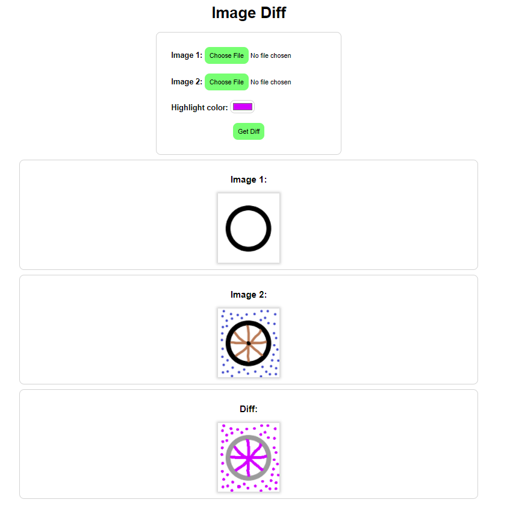

# Image Diff

Highlights the difference between two images using [Flask](https://flask.palletsprojects.com/en/2.0.x/).

## How to run

1. Install depenencies: `pip install -r requirements.txt`
2. Run it: `python imagediff.py`
3. Open http://127.0.0.1:5000 in browser

### Screenshot (Notice the difference):

